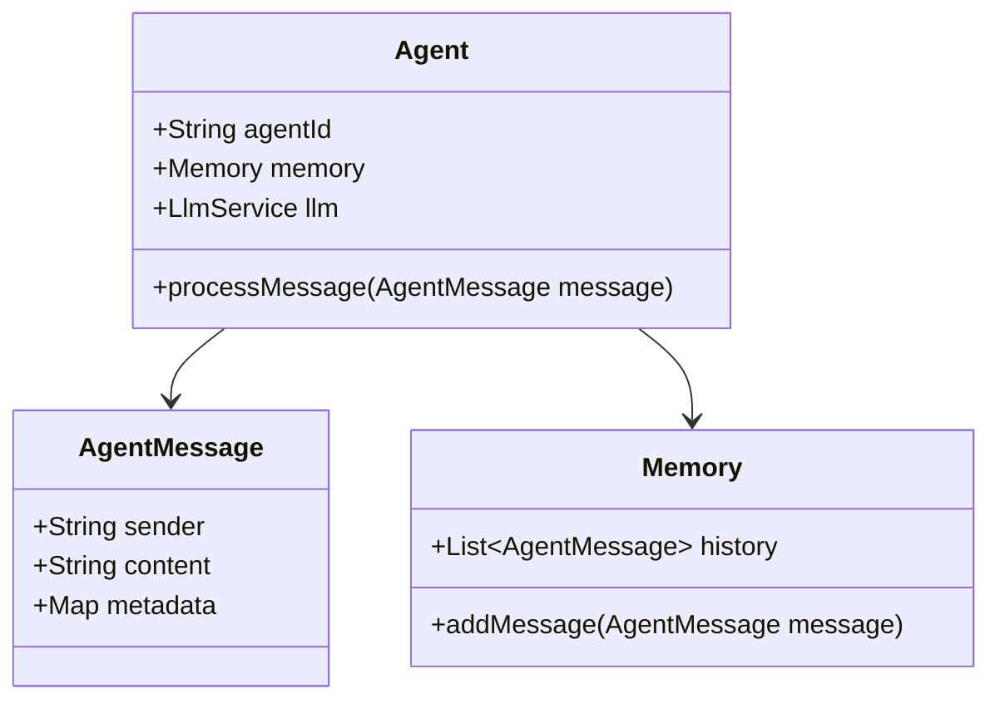

# Lagent4j 开发计划文档

## 项目概述
本项目旨在构建一个Java版本的多智能体框架，参考Python版lagent项目的设计理念和功能特性。主要实现消息传递机制、LLM集成、动作执行器和记忆管理等功能。

## 开发计划

### 第一阶段：核心框架搭建（3天）
- **基础消息流转机制**
    - 实现AgentMessage类
    - 构建消息队列和处理器
    - 设计消息协议格式（JSON）

- **OpenAI接口适配**
    - 封装OkHttp客户端
    - 实现LlmService接口
    - 集成OpenAI API调用

- **基础Agent执行流程**
    - 开发Agent基类
    - 实现基本的消息处理逻辑
    - 构建同步和异步执行模式

### 第二阶段：功能扩展（2天）
- **异步支持**
    - 使用CompletableFuture实现异步处理
    - 设计异步消息队列
    - 实现非阻塞式动作执行

- **常用内置Action**
    - HttpRequestAction
    - FileIOAction
    - PythonInterpreterAction

- **记忆管理模块**
    - 实现MemoryManager
    - 添加会话隔离支持
    - 开发记忆持久化机制

### 第三阶段：优化完善（1天）
- 单元测试覆盖核心模块
- 编写开发者文档
- 创建示例代码和演示项目

## 技术选型
- JSON处理：FastJSON2
- HTTP客户端：OkHttp3
- 工具库：Hutool
- 异步处理：CompletableFuture
- 测试框架：JUnit4

## 注意事项
- 确保与Python版本的功能对齐
- 遵循Java编码规范
- 保持模块间低耦合
- 注重线程安全和性能优化
