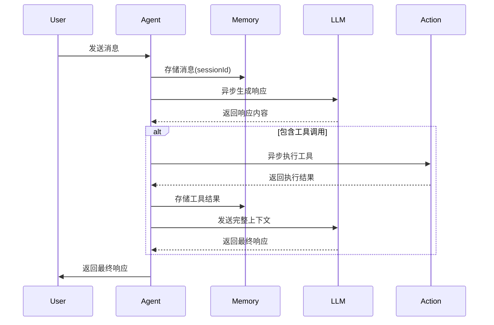

# 基础Agent模块设计文档

## 1. 类图设计
```mermaid
classDiagram
    class AgentMessage {
        +String sender
        +String content
        +Object formatted
        +Map<String, Object> extraInfo
        +AgentMessageType type
    }

    class Memory {
        +Map<Integer, Deque<AgentMessage>> sessions
        +void addMessage(Integer sessionId, AgentMessage message)
        +List<AgentMessage> getMessages(Integer sessionId)
        +void clear(Integer sessionId)
    }

    interface LlmService {
        +CompletableFuture<String> chatAsync(List<AgentMessage> messages)
    }

    interface Action {
        +String getName()
        +String getDescription()
        +CompletableFuture<ActionResult> executeAsync(ActionInput input)
    }

    class BaseAgent {
        #LlmService llmService
        #Memory memory
        #List<Action> actions
        +CompletableFuture<AgentMessage> processAsync(AgentMessage message, Integer sessionId)
        #abstract CompletableFuture<AgentMessage> handleMessage(AgentMessage message)
    }

    class SimpleAgent {
        +SimpleAgent(LlmService llm, List<Action> actions)
        +CompletableFuture<AgentMessage> handleMessage(AgentMessage message)
    }

    AgentMessage --> BaseAgent : 输入/输出
    BaseAgent --> LlmService : 使用
    BaseAgent --> Memory : 管理
    BaseAgent --> Action : 调用
    SimpleAgent --|> BaseAgent
```

## 2. 核心接口定义

### AgentMessage
```java
/**
 * 消息实体类
 * @param sender 发送者标识
 * @param content 原始内容
 * @param formatted 结构化内容（如工具调用参数）
 * @param extraInfo 扩展信息
 * @param type 消息类型（用户输入/Agent响应/工具输出）
 */
public record AgentMessage(
    String sender,
    String content,
    Object formatted,
    Map<String, Object> extraInfo,
    AgentMessageType type
) {}
```

### LlmService 接口
```java
public interface LlmService {
    CompletableFuture<String> chatAsync(List<AgentMessage> messages);
    void setEndpoint(String endpoint); // 支持自定义API地址
}
```

### Action 接口
```java
public interface Action {
    String getName();
    String getDescription();
    CompletableFuture<ActionResult> executeAsync(ActionInput input);
}
```

## 3. 核心处理流程



## 4. 代码示例

```java
// 初始化组件
LlmService llm = new OpenAILlmService("https://api.example.com/v1/chat");
Action pythonAction = new PythonInterpreterAction();
Memory memory = new LRUMemory(1000);

// 创建Agent
BaseAgent agent = new SimpleAgent(llm, List.of(pythonAction), memory);

// 处理消息
AgentMessage userMsg = new AgentMessage("user", "计算2的平方根", null, Map.of(), AgentMessageType.USER);
CompletableFuture<AgentMessage> response = agent.processAsync(userMsg, 0);

// 处理响应
response.thenAccept(msg -> {
    System.out.println("Agent响应：" + msg.content());
    if (msg.formatted() instanceof ToolResult result) {
        System.out.println("工具执行结果：" + result.output());
    }
});
```

## 5. 待实现点
- 记忆淘汰策略（LRU实现）
- 工具调用参数自动解析
- 错误处理重试机制
- 异步超时控制
